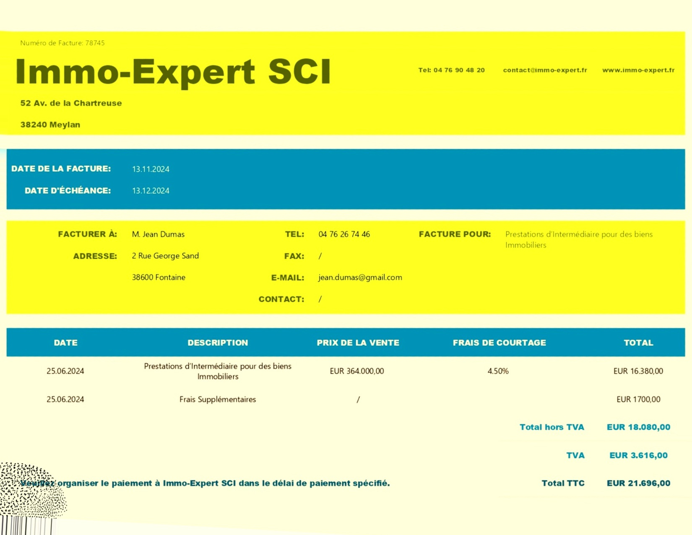
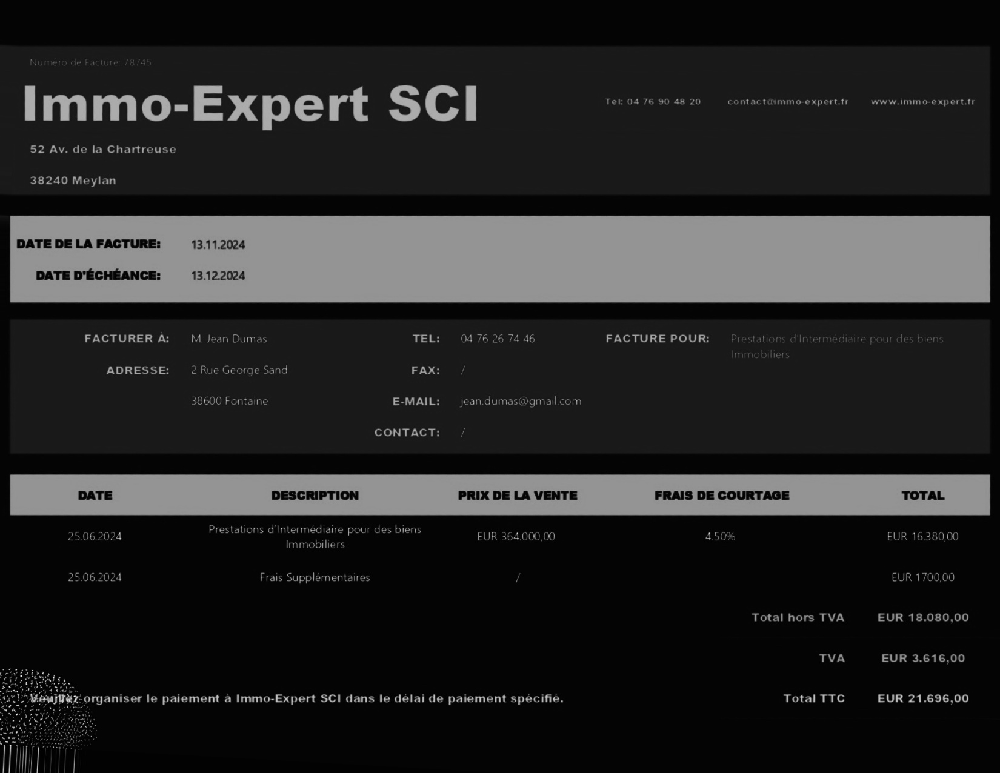

# Billing Info Capture - Applying optical character recognition (OCR) and named entity recgnition (NER) for invoice parsing (Python / OpenCV / PyTesseract / spacy) 

## Overview
In this project, I wrote a program with the aim of enhancing the quality of images and videos which were recorded in the dark. I set up a pipeline which first stretches the color channels and then allows the user to choose from four different transformations:   

## Highlights
- Memory-efficient image and video processing in C++, using the the popular OpenCV library
- Manual implementations of RGB-To-HSI and HSI-To-RGB conversions (since the OpenCV library only includes conversions from/to HSL and HSV color spaces).
- An exact implementation of the AGCWHD method by Veluchamy & Subramani (2024), translating their mathematical formulae step-by-step into C++ code
- An imitation of the image viewer from Qt Creator, allowing for more detailed pixel analysis
- With the code, I am also releasing a [binary](https://github.com/maxschlake/dark-video-quality-boosting/releases/latest) called `boost.exe`, which as to be run from the command line

## Results
<!-- Image Grid with Titles in a Table Layout -->
<table>
  <!-- Row 1: facture1.jpg images -->
  <tr>
    <!-- Column 1 -->
    <td align="center">
      <strong>Given invoice</strong> 
      
    </td>
    <!-- Column 2 -->
    <td align="center">
      <strong>1) Deskewed</strong> 
      
    </td>
    <!-- Column 3 -->
    <td align="center">
      <strong>2) Modified</strong> 
      
    </td>
    <!-- Column 4 -->
    <td align="center">
      <strong>3) With ROI rectangles</strong> 
      
    </td>
  </tr>
   <!-- Row 2: facture2.jpg images -->
  <tr>
    <!-- Column 1 -->
    <td align="center">
      <strong>Original Image</strong> 
      
    </td>
    <!-- Column 2 -->
    <td align="center">
      <strong>Log Transformation</strong> 
      
    </td>
    <!-- Column 3 -->
    <td align="center">
      <strong>Global HE</strong> 
      
    </td>
    <!-- Column 4 -->
    <td align="center">
      <strong>Local HE</strong> 
      
    </td>
  </tr>
</table>

## How to run the program
1. Download the [binary](https://github.com/maxschlake/dark-video-quality-boosting/releases/latest) called `boost.exe`
2. Open the command line and navigate to the corresponding folder that contains `boost.exe`
3. Type `boost.exe`, followed by the **mandatory parameters** listed below:  
- mode&nbsp;&nbsp;&nbsp;&nbsp;&nbsp;&nbsp;&nbsp;&nbsp;&nbsp;&nbsp;&nbsp;&nbsp;&nbsp;&nbsp;&nbsp;&nbsp;&nbsp;&nbsp;&nbsp;----&nbsp;&nbsp;&nbsp;&nbsp;&lt;char&gt;&nbsp;&nbsp;&nbsp;&nbsp;Choose mode: 'image', 'video'  
- rawFileDir&nbsp;&nbsp;&nbsp;&nbsp;&nbsp;&nbsp;&nbsp;&nbsp;&nbsp;&nbsp;&nbsp;&nbsp;----&nbsp;&nbsp;&nbsp;&nbsp;&lt;char&gt;&nbsp;&nbsp;&nbsp;&nbsp;Enter directory of the raw file  
- rawFileName&nbsp;&nbsp;&nbsp;&nbsp;&nbsp;&nbsp;&nbsp;----&nbsp;&nbsp;&nbsp;&nbsp;&lt;char&gt;&nbsp;&nbsp;&nbsp;&nbsp;Enter name of the raw file  
- rawFileType&nbsp;&nbsp;&nbsp;&nbsp;&nbsp;&nbsp;&nbsp;&nbsp;&nbsp;----&nbsp;&nbsp;&nbsp;&nbsp;&lt;char&gt;&nbsp;&nbsp;&nbsp;&nbsp;Enter type of the raw file  
- transformType&nbsp;&nbsp;&nbsp;&nbsp;&nbsp;----&nbsp;&nbsp;&nbsp;&nbsp;&lt;char&gt;&nbsp;&nbsp;&nbsp;&nbsp;Choose transform type: 'log', 'locHE', 'globHE', 'AGCWHD'  
- L&nbsp;&nbsp;&nbsp;&nbsp;&nbsp;&nbsp;&nbsp;&nbsp;&nbsp;&nbsp;&nbsp;&nbsp;&nbsp;&nbsp;&nbsp;&nbsp;&nbsp;&nbsp;&nbsp;&nbsp;&nbsp;&nbsp;&nbsp;&nbsp;&nbsp;&nbsp;&nbsp;----&nbsp;&nbsp;&nbsp;&nbsp;&lt;int&gt;&nbsp;&nbsp;&nbsp;&nbsp;Enter the number of possible intensity values  
- verbose]&nbsp;&nbsp;&nbsp;&nbsp;&nbsp;&nbsp;&nbsp;&nbsp;&nbsp;&nbsp;&nbsp;&nbsp;&nbsp;&nbsp;&nbsp;----&nbsp;&nbsp;&nbsp;&nbsp;&lt;bool&gt;&nbsp;&nbsp;&nbsp;&nbsp;Show extended commentary  
5. Depending on which <ins>mode</ins> (**image** or **video**) and which <ins>transformType</ins> (**log**, **locHE**, **globHE** or **AGCWHD**) you are using, you have to provide the tags for **optional parameters**, followed by their value.
- [show]&nbsp;&nbsp;&nbsp;&nbsp;&nbsp;&nbsp;&nbsp;&nbsp;&nbsp;&nbsp;&nbsp;&nbsp;&nbsp;&nbsp;&nbsp;&nbsp;&nbsp;&nbsp;----&nbsp;&nbsp;&nbsp;&nbsp;&lt;bool&gt;&nbsp;&nbsp;&nbsp;&nbsp;Show output image (only for 'image' mode)
- [inputScale]&nbsp;&nbsp;&nbsp;&nbsp;&nbsp;&nbsp;&nbsp;&nbsp;&nbsp;&nbsp;----&nbsp;&nbsp;&nbsp;&nbsp;&lt;double&gt;&nbsp;&nbsp;&nbsp;&nbsp;Enter the input scale (only for 'log' transform type)
- [clipLimit]&nbsp;&nbsp;&nbsp;&nbsp;&nbsp;&nbsp;&nbsp;&nbsp;&nbsp;&nbsp;&nbsp;&nbsp;&nbsp;----&nbsp;&nbsp;&nbsp;&nbsp;&lt;double&gt;&nbsp;&nbsp;&nbsp;&nbsp;Enter the clip limit (only for 'locHE' transform type)
- [tileGidWidth]&nbsp;&nbsp;&nbsp;&nbsp;&nbsp;&nbsp;----&nbsp;&nbsp;&nbsp;&nbsp;&lt;int&gt;&nbsp;&nbsp;&nbsp;&nbsp;Enter the tile grid width (only for 'locHE' transform type)
- [tileGridHeight]&nbsp;&nbsp;&nbsp;&nbsp;----&nbsp;&nbsp;&nbsp;&nbsp;&lt;int&gt;&nbsp;&nbsp;&nbsp;&nbsp;Enter the tile grid height (only for 'locHE' transform type)

For example,
- to process the image `example.jpg` in directory `directory/of/example/image` with 256 possible intensity values, using the *globHE* transformation with verbose commentary, type:  
`boost.exe image directory/of/example/image example jpg globHE 256 true --show true`   
- to process a video, the `--show` parameter is not needed. However, if you use a *log* transformation on an image or a video, then you need to specify the `--inputScale` factor. So, in order to log transform the `example.mp4` video in the `directory/of/example/video` (again using 256 possible intensity values and verbose commentary), with an inputScale of 0.5, type  
`boost.exe video directory/of/example/video example mp4 log 256 true --inputScale 0.5`   
- to process an image `example.jpg` in directory `directory/of/example/image` with 256 possible intensity values, this time using the *locHE* transformation with verbose commentary, you need to specify `--show` (because it is an image) as well as `--clipLimit`, `--tileGridWidth`, and `--tileGridHeight`. For a clipLimit of 2.5 and an 8x8 tile grid, type:  
`boost.exe image directory/of/example/image example jpg locHE 256 true --show true --clipLimit 2.5 --tileGridWidth 8 --tileGridHeight 8`
