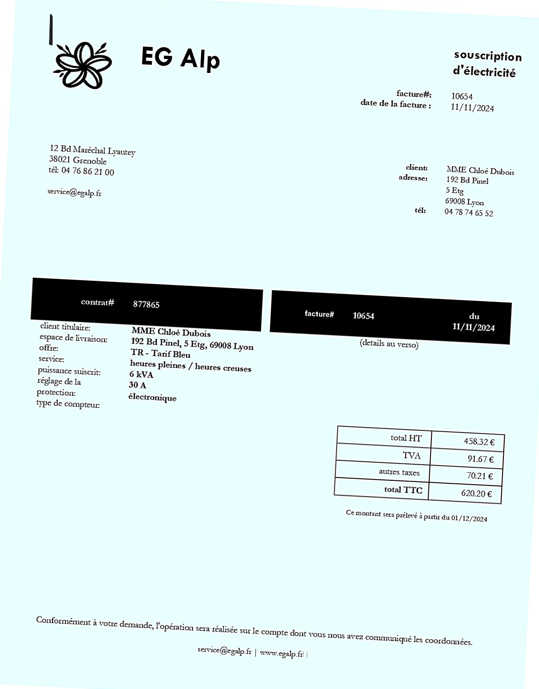

# Billing Info Capture - Applying optical character recognition (OCR) and named entity recognition (NER) to French invoices (Python / OpenCV / PyTesseract / spaCy) 

## Overview
This is a smaller project to demonstrate how a combination of *Python* libraries can be utilized to read key information from French invoices. The invoices are not assumed to follow a certain template; rather the aim is for the program to adjust automatically to different formats, distortions, rotations, etc. <br/>

I am first using the *OpenCV* library to preprocess each invoice image and obtain the regions of interest (**ROIs**). Afterwards, *PyTesseract* reads the content of each ROI and a French NER model from *spaCy* identifies relevant entities in the text. The entities are then combined with a custom-built logic which, e.g., checks for certain keywords or finds the ROI with the maximum average character height. As a final result, we obtain the output data from two example invoices stored in the JSON format.

## Structure
- `src/main.py`: High-level command which loops through the invoices and creates the final JSON file.
- `src/pipeline.py`: A wrapper which puts the various processing functions (for both image & text) as well as the OCR and NER commands in the right order; outputs the captured data from a single invoice.
- `src/processText.py`: A collection of processing functions for textual data; contains the custom-built logic which combines all the information.
- `src/processImage.py`: A collection of processing functions for image data.

## Results
### I) Obtain ROIs from each invoice
<!-- Image Grid with Titles in a Table Layout -->
<table>
  <!-- Row 1: facture1.jpg images -->
  <tr>
    <!-- Column 1 -->
    <td align="center">
      <strong>1) Given invoice</strong><br>
      
    </td>
    <!-- Column 2 -->
    <td align="center">
      <strong>2) Deskewed</strong><br>
      
    </td>
    <!-- Column 3 -->
    <td align="center">
      <strong>3) Modified</strong><br>
      
    </td>
    <!-- Column 4 -->
    <td align="center">
      <strong>4) With ROI rectangles</strong><br>
      
    </td>
  </tr>
   <!-- Row 2: facture2.jpg images -->
  <tr>
    <!-- Column 1 -->
    <td align="center">
      
    </td>
    <!-- Column 2 -->
    <td align="center">
      
    </td>
    <!-- Column 3 -->
    <td align="center">
      
    </td>
    <!-- Column 4 -->
    <td align="center">
      
    </td>
  </tr>
</table>

### II) Capture the information from each ROI
Running through each single ROI separately results in more accurate OCR and NER. <br/>
The output is written to the `invoiceData.json` file in the root folder:
```
[
    {
        "invoiceNumber": "10654",
        "supplierName": "EG Alp",
        "clientName": "Chlo\u00e9 Dubois",
        "invoiceAmount": "620.20 EUR",
        "invoiceDate": "2024-11-11",
        "dueDate": "2024-12-01"
    },
    {
        "invoiceNumber": "78745",
        "supplierName": "Immo-Expert SCI",
        "clientName": "Jean Dumas",
        "invoiceAmount": "21696.00 EUR",
        "invoiceDate": "2024-11-13",
        "dueDate": "2024-12-13"
    }
]
```

## Dependencies
- *Python*: Version 3.10.6
- *OpenCV*: Version 4.10.0
- *PyTesseract*: Version 0.3.13
- *spaCy*: Version 3.8.2
<br/><br/>
**Note**: In order to use the French NER model *fr_core_news_lg* from *spaCy*, you need to run <br/><br/>
`python -m spacy download fr` <br/><br/>
followed by the following commands in *Python*: <br/><br/>
`import spacy` <br/>
`spacy.load('fr_core_news_lg')`
